# Routing & Navigation

Tài liệu này cung cấp một số khái niệm và ví dụ cụ thể  về Routing & Navigation trong App Route của thằng Next.js. [Link sản phẩm](https://demo-routing-navigation.netlify.app/)

## Mục lục

- [Hướng dẫn chạy dự án](#hướng-dẫn-chạy-dự-án)
- [File-system - Route theo thư mục](#file-system---route-theo-thư-mục)
- [Client Side - Điều hướng](#client-side---điều-hướng)
- [Server Side - Điều hướng](#server-side---điều-hướng)
- [Giao diện](#giao-diện)
- [Next Server](#next-server)
- [Localization - Ngôn ngữ](#localization---ngôn-ngữ)
- [Route không theo thư mục](#route-không-theo-thư-mục)

---------------

## Hướng dẫn chạy dự án

## File-system - Route theo thư mục

### 1. Danh sách file

Dưới đây là danh sách file và mục đích sử dụng của từng file trong App Route:

| File          | Mục đích sử dụng                                                                 |
|:--------------|:---------------------------------------------------------------------------------|
| page.tsx      | Component chính của route                                                        |
| layout.tsx    | Dùng để bọc layout cho route và các route con                                    |
| template.tsx  | Giao diện bọc route con, nhưng khi điều hướng sẽ render lại                      |
| error.tsx     | Bắt lỗi khi render route                                                         |
| loading.tsx   | Hiển thị khi đang tải                                                            |
| not-found.tsx | Hiển thị khi không tìm thấy nội dung (page 404)                                  |
| default.tsx   | Định nghĩa nội dung mặc định cho một route khi không có route con nào được chọn  |
| route.ts      | Tạo ra các API route                                                             |

Ví dụ minh hoạ về cấu trúc file:

```plaintext
/app
├── dashboard
│   ├── page.tsx
│   ├── layout.tsx
│   ├── template.tsx
│   ├── error.tsx
│   ├── loading.tsx
│   ├── not-found.tsx
├── api
│   └── route.ts
├── layout.tsx
├── page.tsx
```

### 2. Route group

Trong App Route chúng ta có thể nhóm các chức năng giống nhau vào 1 nhóm chung bằng 1 thư mục bằng cú pháp `(tên thư mục)`. Ví dụ minh hoạ:

```plaintext
/app
├── (auth)
│   ├── login
│   |    ├── page.tsx
│   ├── register
│   |    ├── page.tsx
│   ├── profile
│   |    ├── page.tsx
│   ├── layout.tsx
├── layout.tsx
├── page.tsx
```

### 3. Đường dẫn động

Đường dẫn động(Dynamic Routes) là cách chúng ta sử dụng các url có nhận tham số, để thay đổi thông tin dựa vào tham số nhận được.

Ví dụ minh hoạ:

```plaintext
/app
├── (home)
│   ├── products
│   ├── ├── [id] 
│   ├── |    ├── page.tsx
│   ├── ├── page.tsx
├── ├── layout.tsx
├── ├── page.tsx
```

```tsx
//app/products/[id]/page.tsx
export default async function ProductDetail({ params }: { params: Promise<{ id: string }> }) {
  const { id } = await params;

  return (
    <div>
      <h1>
        Product Detail: {id}
      </h1>
    </div>
  );
}
```

Hình ảnh chỉ mang tính chất minh hoạ, mời mọi người vào [link demo](https://demo-routing-navigation.netlify.app/products/1) để xem chi tiết ạ


### 4. Chặn route

Khái niệm về `Intercepting Routes` dùng để chặn một yêu cầu đi đến route cụ thể và thay đổi hành vi của nó, thường sử dụng để hiển thị 1 nội dung khác hoặc xử lý logic mà không thay đổ URL. Một số ứng dụng thực tế như: modal, drawer, tab, ...

## Client Side - Điều hướng

Navigation - Điều hướng là quá trình chuyển sang 1 trang khác mà không cần phải tải lại toàn bộ trang. Cách này chỉ được sử dụng khi người dùng tác động

### 1. Linking

Chúng ta sẽ sử dụng `Link Component` để điều hướng trang web, và sau khi render sang html `Link Component` sẽ được hiển thị dưới dạng thẻ a . Ví dụ cụ thể:

```tsx
// components/layout/header.tsx
import NavLink from "../ui/navlink";

export default function Header() {
    return (
      <ul className="flex items-center space-x-4">
          <li>
              <NavLink href="/">
                  Home
              </NavLink>
          </li>
          <li>
              <NavLink href="/about">
                  About
              </NavLink>
          </li>
      </ul>
    )
}
```

Hình ảnh chỉ mang tính chất minh hoạ, mời mọi người vào [link demo](https://demo-routing-navigation.netlify.app/) để xem chi tiết ạ


### 2. Navigation

Sử dụng hook `useRouter` của `"next/navigation"` để trong xử lý logic hoặc handler sự kiện trong môi trường client side. Dùng để điều hướng đến một URL mới ở trang hiện tại, và sẽ có 2 cách chính là `push`, `replace`

>Lưu ý: `useRouter` chỉ được sử dụng trong môi trường client side, và khi import tránh nhầm thằng `"next/router"` vì cái mình cần dùng là `"next/navigation"`

`router.push('/new-url')` dùng khi muốn điều hướng sang trang mới và đồng thời thêm mới đường dẫn thay đổi vào lịch sử trình duyệt trình duyệt

```tsx
// app/(home)/about/page.tsx
'use client'

import { useRouter } from "next/navigation";

export default function About() {
  const router = useRouter();
  
  return (
    <button 
      onClick={() => router.push('/')} 
    >
      Go Back to Home (Hook)
    </button>
  );
}
```

Hình ảnh chỉ mang tính chất minh hoạ, mời mọi người vào [link demo](https://demo-routing-navigation.netlify.app/about) để xem chi tiết ạ


`router.replace('/updated-url')` cái cũng sẽ điều hướng sang trang mới, nhưng khác `push` ở chỗ ở `push` sẽ tạo mới lịch sử nhưng cái này sẽ cập nhật lại url trang hiện tại trong lịch sử trình duyệt

```tsx
// app/(home)/contact/page.tsx
'use client'

import { useRouter } from "next/navigation";

export default function Contact() {
  const router = useRouter();
  
  return (
    <button 
      onClick={() => router.replace('/')} 
    >
      Go Back to Home (Hook)
    </button>
  );
}
```

Hình ảnh chỉ mang tính chất minh hoạ, mời mọi người vào [link demo](https://demo-routing-navigation.netlify.app/contact) để xem chi tiết ạ


Thằng hook `useRouter` của `"next/navigation"` vẫn còn một số thuộc tính như: pathname, query, asPath, isFallback để lấy thông tin URL hay các phương thức khác như: back(), reload(), prefetch().  Vì nó không liên quan lắm đến phần này nên mình sẽ không đưa vào để tránh loạn, anh em chịu khó tìm hiểu thêm sau nhé

### 3. Window

Nếu như bạn đã học về javascript thì cũng sẽ biết thằng window cũng có một số phương thức để điều hướng trang. Cũng vậy thằng next.js vẫn sẽ cho phép sử dụng các phương thức như vậy, có 2 cái cần nói đến ở đây đó là `window.history.pushState` và `window.history.replaceState`.

>Lưu ý: `window.history.pushState` và `window.history.replaceState` trong nextjs cũng có phương thức tương tự là sử dụng hook `useRoute` với `router.push('/new-url')` và `router.replace('/updated-url')`. Cho nên phần window này chỉ nêu ra để biết là có thể sử dụng mà thôi chứ không hay dùng

`pushState(stateObj, title, url)` Nó sẽ thêm mới 1 đường dẫn vào lịch sử của trình duyệt, và điều hướng trang đến url mới mà không phải reload lại trang hiện tại.

```tsx
// app/(home)/about/page.tsx
'use client'

export default function About() {
  const pushWindow = (url: string) => {
    window.history.pushState({}, '', url);
  }

  return (
    <button
        onClick={() => pushWindow('/')}
      >
        Go Back to Home (Window)
      </button>
  );
}
```

Hình ảnh chỉ mang tính chất minh hoạ, mời mọi người vào [link demo](https://demo-routing-navigation.netlify.app/about) để xem chi tiết ạ


`replaceState(stateObj, title, url)` Cái này nó sẽ thay thế URL trang hiện tại và thay thế cả trong lịch sử trình duyệt

```tsx
// app/(home)/contact/page.tsx
'use client'

export default function Contact() {
  const replaceWindow = (url: string) => {
    if (typeof window !== 'undefined') {
      window.history.replaceState({}, '', url);
    }
  }
  
  return (
    <button
        onClick={() => replaceWindow('/')}
        className="bg-blue-600 hover:bg-blue-700 text-white px-6 py-3 rounded-lg mt-8 shadow-lg transition-all duration-300 transform hover:scale-105"
      >
      Go Back to Home (Window)
    </button>
  );
}
```

Hình ảnh chỉ mang tính chất minh hoạ, mời mọi người vào [link demo](https://demo-routing-navigation.netlify.app/contact) để xem chi tiết ạ


### 3. So sánh giữa các phương thức thay đổi URL

| Phương thức               | Thay đổi URL | Điều hướng | Lịch sử trình duyệt | Tương thích Next.js Router | Ghi chú |
|---------------------------|--------------|--------------|------------------------|---------------------------|---------|
| `window.history.replaceState` | ✅ Có        | ❌ Không     | ❌ Thay thế đường dẫn hiện tại | ❌ Không đồng bộ | Chỉ thay đổi URL, không kích hoạt điều hướng hay cập nhật Next.js Router |
| `router.replace()` (Next.js) | ✅ Có       | ✅ Có     | ❌ Thay thế đường dẫn hiện tại | ✅ Có (đồng bộ) | Nên dùng thay thế để đồng bộ với Next.js |
| `window.history.pushState` | ✅ Có        | ❌ Không     | ✅ Thêm đường dẫn mới       | ❌ Không đồng bộ | Thêm URL mới vào lịch sử trình duyệt |
| `router.push()` (Next.js)  | ✅ Có        | ✅ Có     | ✅ Thêm đường dẫn mới       | ✅ Có (đồng bộ) | Đồng bộ với Next.js Router, hỗ trợ tải trước trang |

## Server Side - Điều hướng

Redirect là việc chuyển người dùng đến một URL khác, trước hoặc trong lúc trang đang load. Có thể sử dụng ở 2 môi trường server và client

### 1. redirect function

`redirect('/đường-dẫn')` là 1 function dùng để điều hướng trang, và sử dụng ở cả 3 môi trường là server side, client side và next server.

Đặc biệt nó cũng có thể sử dụng phương thức PUSH và REPLACE giống như thằng hook `useRouter`, cú pháp thì chỉ cần thêm đối số RedirectType vào redirect function. Ví dụ `redirect('/đường-dẫn', RedirectType.push)` hoặc `redirect('/đường-dẫn', RedirectType.replace)`.

```tsx
// app/dashboard/page.tsx
import { redirect } from "next/navigation";
import { useEffect } from "react";

export default function Page() {
  useEffect(() => {
    // Kiểm tra localStorage khi component mount
    const isLoggedIn = localStorage.getItem('isLoggedIn') === 'true';

    if (!isLoggedIn) {
      // Nếu chưa đăng nhập, redirect về trang login
      redirect('/login');
    }
  }, []);

  return (
    <div>
      <h1>Dashboard</h1>
    </div>
  );
}
```

Hình ảnh chỉ mang tính chất minh hoạ, mời mọi người vào [link demo](https://demo-routing-navigation.netlify.app/dashboard) để xem chi tiết ạ

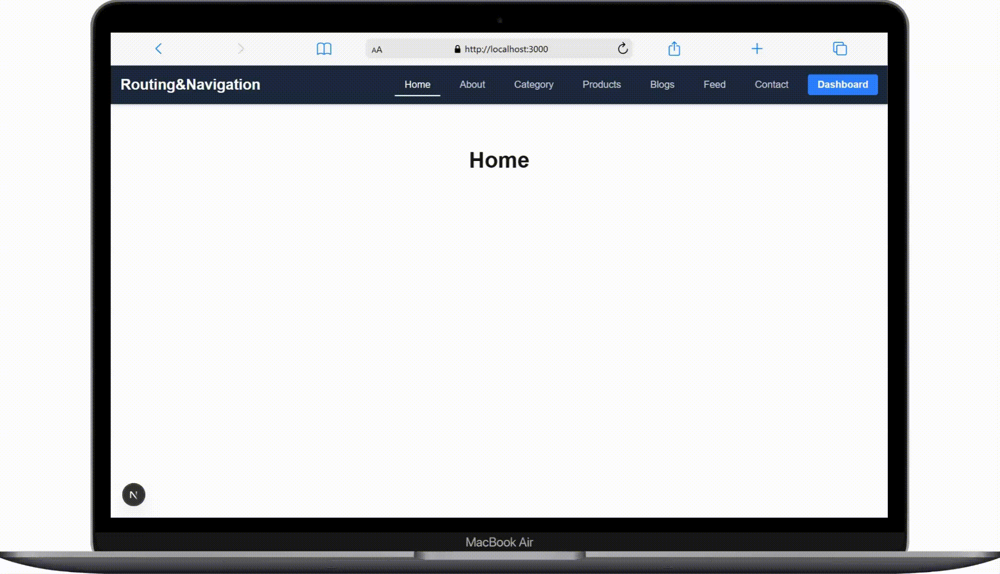

### 2. permanentRedirect function

`permanentRedirect` thằng này giống hệt với `redirect` là 1 function dùng để điều hướng trang, và sử dụng ở cả 3 môi trường là server side, client side và next server.

> Nhưng khác:
>
> - `redirect` trả về status code là 307 là tạm thời
> - `permanentRedirect` trả về status code là 308 là vĩnh viễn
>
> Khác status code ở đây nó chỉ ảnh hưởng đến vấn đề SEO. Hiểu đơn giản thì khi muốn đây website lên top tìm kiếm thì Google phải map site các URL của mình. Trường hợp có thể sử dụng 307 là để khi hệ thống bảo trì mà không muốn ảnh hưởng đến ranking trên top tìm kiếm của Google, hoặc 308 là xác định thay đổi vĩnh viễn ví dụ như muốn đổi qua domain khác thì Google sẽ không map đến cái site đó nữa

```tsx
// app/dashboard/old/page.tsx
import { permanentRedirect } from "next/navigation";

export default function Page() {
    permanentRedirect("/dashboard/new");

    return (
        <>
            <h1>Old Page</h1>
        </>
    );
}
```

```tsx
// app/dashboard/new/page.tsx
export default function Page() {
  return (
    <>
      <h1>New Page</h1>
    </>
  );
}
```

### 3. Next config

`redirects in next.config.js` giống với `redirect` và `permanentRedirect` giúp điều hướng trang và sẽ trả về status 307(tạm thời) và 308(vĩnh viễn), nhưng khác là chúng ta sẽ cấu hình luôn ở file config.

```plaintext
/app
├── dashboard
│   ├── overview
│   ├── ├── page.tsx
|   ├── overview-new
│   ├── ├── page.tsx
```

```ts
import type { NextConfig } from "next";

const nextConfig: NextConfig = {
  async redirects() {
    return [
      {
        source: '/dashboard/overview',
        destination: '/dashboard/overview-new',
        permanent: true, // Code 308 - Điều hướng vĩnh viễn
      },
    ]
  },
};

export default nextConfig;
```

## Giao diện

### 1. Layout & Page

`Layout` hay `layout.tsx` là phần giao diện bên ngoài bao bọc nội dung.

```tsx
// app/dashboard/layout.tsx

import Header from "@/components/layout/header";

export default function DashboardLayout({
  children,
}: Readonly<{
  children: React.ReactNode;
}>) {
  return (
    <html lang="en">
      <body>
        <Header />
        <div>
          {children}
        </div>
      </body>
    </html>
  );
}
```

```tsx
// app/dashboard/profile/page.tsx

export default function Page() {
    return (
        <div>
            //Nội dung
        </div>
    );
}
```

Hình ảnh chỉ mang tính chất minh hoạ, mời mọi người vào [link demo](https://demo-routing-navigation.netlify.app/dashboard/profile) để xem chi tiết ạ

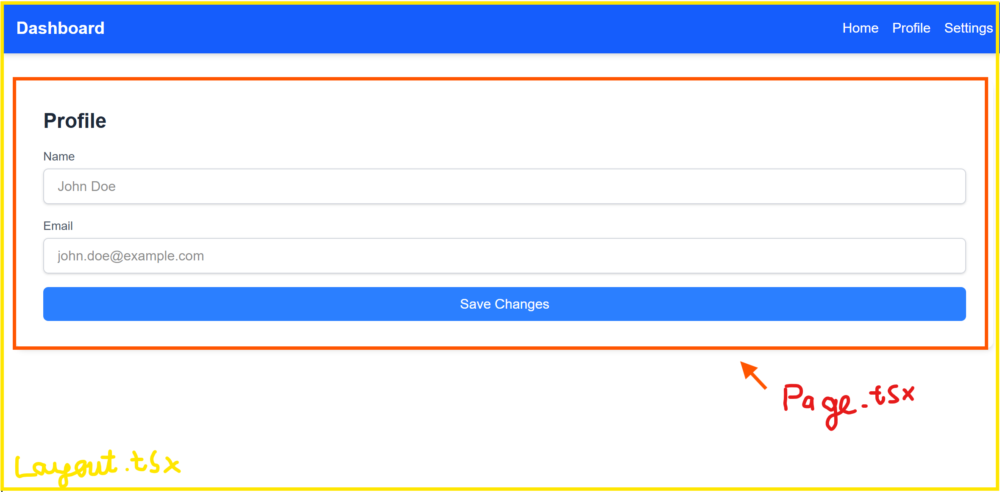

### 2. Template

`Template` hay `template.tsx` giống với Layout là phần giao diện bên ngoài bao bọc nội dung.

> Nhưng cách hoạt động khác:
> Layout → Template → Page

```tsx
// app/dashboard/layout.tsx

import Header from "@/components/layout/header";

export default function DashboardLayout({
  children,
}: Readonly<{
  children: React.ReactNode;
}>) {
  console.log('Render layout!!!');

  return (
    <html lang="en">
      <body>
        <Header />
        <div>
          {children}
        </div>
      </body>
    </html>
  );
}
```

```tsx
export default function DashboardTemplate({ children }: { children: React.ReactNode }) {
  console.log('Render template!!!');

  return (
    <div>
      <aside>
        <div>
          <h1>Dashboard</h1>
          <nav>
            <ul className="flex space-x-4">
              <li><a href="#">Home</a></li>
              <li><a href="#">Profile</a></li>
              <li><a href="#">Settings</a></li>
            </ul>
          </nav>
        </div>
      </aside>
      <main>{children}</main>
    </div>
  );
}
```

```tsx
// app/dashboard/profile/page.tsx

export default function Page() {
    console.log('Render page!!!');

    return (
        <div>
            //Nội dung
        </div>
    );
}
```

Hình ảnh chỉ mang tính chất minh hoạ, mời mọi người vào [link demo](https://demo-routing-navigation.netlify.app/dashboard/profile) để xem chi tiết ạ

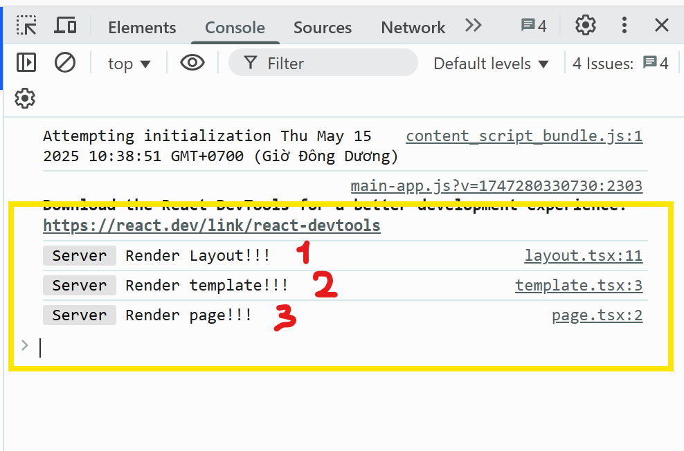

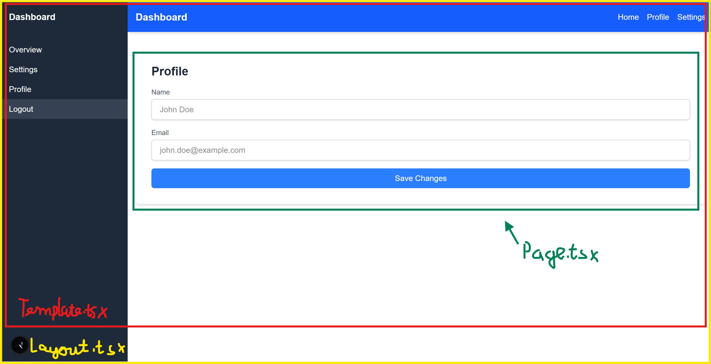

### 3. Parallel Routes

`Parallel Routes` cho phép chúng ta hiển thị cùng lúc nhiều nội dung độc lập, hiểu đơn giản hơn là các slot(trang con) hoạt động độc lập được chèn vào bên trong trang.

Lý do cần dùng thằng này vì nó cho phép tải song song cùng lúc nhiều routes(là các slot) rồi hiển thị trên 1 trang giúp tăng hiệu suất tải trang, ứng dụng 1 số trường hợp như: lấy dữ liệu từ mạng xã hội, hiển thị nhiều nội dung, ...

Tạo thư mục `@slot` trang con

```plaintext
/app
├── dashboard
|   ├── overview-new
│   ├── ├── @table1
│   ├── ├── ├── page.tsx
│   ├── ├── @table2
│   ├── ├── ├── page.tsx
│   ├── ├── layout.tsx
│   ├── ├── page.tsx
```

> Lưu ý: @slot chỉ có thể sử dụng trong file layout.tsx

```tsx
// app/dashboard/overview-new/@table1/page.tsx
export default function Page() {
    return (
        <div>
            <h2>Table 1</h2>
            <table></table>
            </table>
        </div>
    )
}

// app/dashboard/overview-new/@table2/tsx
export default function Page() {
    return (
        <div>
            <h2>Table 2</h2>
            <table></table>
            </table>
        </div>
    )
}
```

```tsx
// app/dashboard/overview-new/layout.tsx
export default function OverviewLayout({
    children,
    table1,
    table2,
}: {
    children: React.ReactNode,
    table1: React.ReactNode,
    table2: React.ReactNode,
}) {
    return (
        <div>
            <div>{children}</div> //page.tsx
            <div>
                <div>{table1}</div> //@table1/page.tsx
                <div>{table2}</div> //@table2/page.tsx
            </div>
        </div>
    );
}
```

Hình ảnh chỉ mang tính chất minh hoạ, mời mọi người vào [link demo](https://demo-routing-navigation.netlify.app/dashboard/overview-new) để xem chi tiết ạ

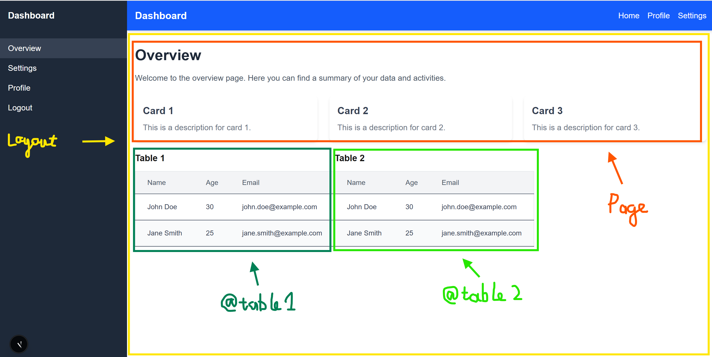

### 4. Error

`Error` hay `error.tsx` là 1 file giao diện mà trong quá trình xử lý logic trang mà gặp lỗi sẽ trả về giao diện này.

```tsx
// app/dashboard/users/page.tsx

export default async function Page() {
    try {
        const response = await fetch(`http://...`, {
            method: 'GET',
        });

        if (!response.ok) {
            throw new Error('Failed to fetch product data');
        }
    } catch {
        throw new Error('An error occurred while fetching the data');
    }

    return (
        <div>
            <h1>List users</h1>
        </div>
    );
}
```

```tsx
// app/dashboard/page.tsx

'use client';

export default function Error({ error, reset }: { error: Error; reset: () => void }) {
  return (
    <div>
      <div>
        <h1>
          Oops! Something went wrong
        </h1>
        <p>
          {error.message}
        </p>
        <button
          onClick={reset}
        >
          Try Again
        </button>
      </div>
    </div>
  );
}   
```

Hình ảnh chỉ mang tính chất minh hoạ, mời mọi người vào [link demo](https://demo-routing-navigation.netlify.app/dashboard/users) để xem chi tiết ạ

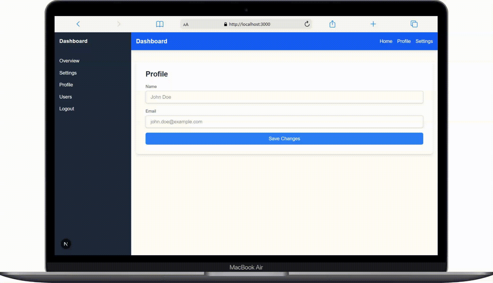

### 5. Loading

`Loading` hay `loading.tsx` là 1 file giao diện sẽ hiện ra trong lúc tải trang.

```tsx
// app/dashboard/loading.tsx

export default function Loading() {
  return (
    <div>
      <span>Loading...</span>
    </div>
  );
}
```

```tsx
// app/dashboard/fake-loading/page.tsx

export default async function Page() {
    await new Promise(() => {
        setTimeout(() => {
        }, 200)
    })

    return (
        <div>
            Test loading
        </div>
    )
}
```

Hình ảnh chỉ mang tính chất minh hoạ, mời mọi người vào [link demo](https://demo-routing-navigation.netlify.app/dashboard/fake-loading) để xem chi tiết ạ


### 6. Not Found

`Not Found` hay `not-found.tsx` là 1 file giao diện sẽ hiện ra khi trang web không tồn tại (Page 404).

```tsx
import Link from "next/link";

export default function NotFound() {
  return (
    <div>
      <h1>404</h1>
      <h2>Page Not Found</h2>
      <p>
        Oops! The page you are looking for does not exist or has been moved.
      </p>
      <Link href="/">
        Go Back Home
      </Link>
    </div>
  );
}
```

Hình ảnh chỉ mang tính chất minh hoạ, mời mọi người vào [link demo](https://demo-routing-navigation.netlify.app/dashboard/fake-notfound) để xem chi tiết ạ


## Next Server

### 1. Route Handlers

Next.JS cung cấp khả năng tạo ra các đầu API với các phương thức HTTP request (GET, POST, PUT, PATCH, DELETE) ngay trong thư mục `app/api` của ứng dụng Next mà không phải có 1 server riêng biệt để xử lý việc này gọi là `Next Server`.

Sau đây là ví dụ cụ thể

```ts
// app/api/products/db.ts

import { Product } from "@/types";

export const products: Product[] = [
    ...Array.from({ length: 50 }, (_, i) => ({
        id: i + 1,
        name: `Product ${i + 1}`,
        description: `Description for product ${i + 1}.`,
        image: 'https://picsum.photos/200/300',
        price: Math.floor(Math.random() * 1000) + 50,
        inStock: Math.random() > 0.5,
    })),
];
```

```ts
// app/api/products/route.ts

import { products } from '@/app/api/products/db';
import { Product } from '@/types';
import { NextResponse } from 'next/server';

export async function GET(request: Request) {
  const { searchParams } = new URL(request.url);
  const page = parseInt(searchParams.get('page') || '1');
  const limit = parseInt(searchParams.get('limit') || '10');
  const startIndex = (page - 1) * limit;
  const response = {
    total: products.length,
    totalPages: Math.ceil(products.length / limit),
    currentPage: page,
    itemsPerPage: limit,
    data: products.slice(startIndex, startIndex + limit),
  };
  return NextResponse.json(response);
}

export async function POST(req: Request) {
  const body: Product = await req.json();
  products.push(body);
  return NextResponse.json({ message: 'Product added successfully', product: body });
}
```

Sử dụng Dynamic Route để xoá, sửa, lấy ra từng sản phẩm 1 

```ts
import { products } from '@/app/api/products/db';
import { Product } from '@/types';
import { NextResponse } from 'next/server';

async function validateId(params: Promise<{ id: string }>) {
  const { id } = await params;
  if (!id || isNaN(Number(id))) {
    throw new Error('Invalid ID');
  }
  return Number(id);
}

export async function GET(request: Request, { params }: { params: Promise<{ id: string }> }) {
  try {
    const id = await validateId(params);
    const product = products.find((p) => p.id === id);
    if (!product) {
      return NextResponse.json({ error: 'Product not found' }, { status: 404 });
    }
    return NextResponse.json(product);
  } catch (error) {
    return NextResponse.json({ error: error.message }, { status: error.message === 'Invalid ID' ? 400 : 500 });
  }
}

export async function DELETE(request: Request, { params }: { params: Promise<{ id: string }> }) {
  try {
    const id = await validateId(params);
    const productIndex = products.findIndex((p) => p.id === id);
    if (productIndex === -1) {
      return NextResponse.json({ error: 'Product not found' }, { status: 404 });
    }
    products.splice(productIndex, 1);
    return NextResponse.json({ message: 'Product deleted successfully' });
  } catch (error) {
    return NextResponse.json({ error: error.message }, { status: error.message === 'Invalid ID' ? 400 : 500 });
  }
}
```

Hình ảnh chỉ mang tính chất minh hoạ, mời mọi người vào [link demo](https://demo-routing-navigation.netlify.app/dynamic-route/products) để xem chi tiết ạ

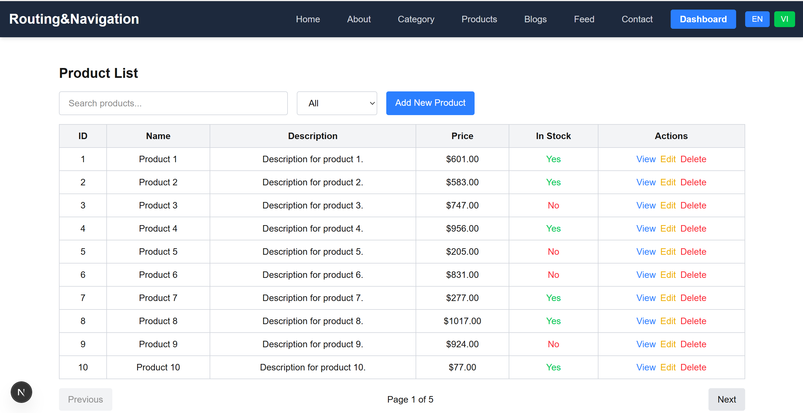

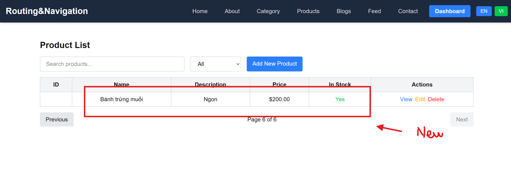

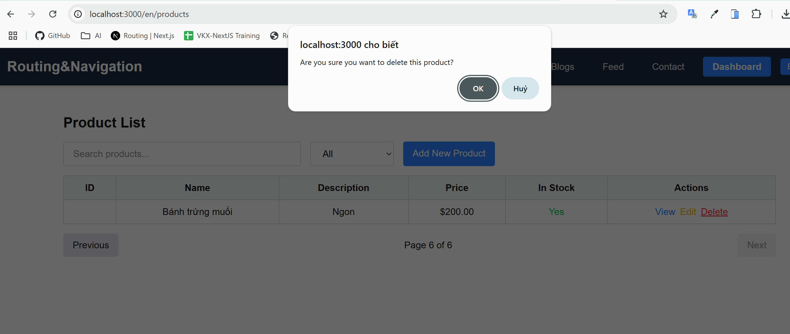

### 2. Middleware

`Middleware` hay `middleware.ts` là file được đặt cùng cấp với thư mục `app`

Cấu trúc file Middleware:

```ts
// middleware.ts
import { NextRequest, NextResponse } from 'next/server';

export function middleware(request: NextRequest) {

  // Logic

  return NextResponse.next();
}
```

- NextRequest: Là request gửi đến.
- NextResponse: Dùng để trả về response, chuyển hướng, hoặc tiếp tục xử lý request.
- NextResponse.next(): Cho phép request tiếp tục đến route tiếp theo.
- NextResponse.redirect(): Chuyển hướng đến một URL khác.
- NextResponse.rewrite(): Viết lại URL mà không thay đổi URL hiển thị trên trình duyệt.

Chúng ta cũng có thể cấu hình để `middleware` sử dụng cho 1 số trường hợp cụ thể. Ví dụ:

```ts
export const config = {
  matcher: ['/api/:path*'], // chỉ sử dụng cho route /api
};
```

### 3. Route caching

Next.JS cũng cấp khả năng caching với các task vụ như: fetching data, route handlers(Next server).

Ví dụ cụ thể:

```tsx
// app/(home)/blogs/page.tsx

'use client';

import { Blog } from '@/types';
import Link from 'next/link';
import React, { useEffect, useState } from 'react';

export default function BlogsPage() {
  const [blogs, setBlogs] = useState<Blog[]>([]);

  useEffect(() => {
    const fetchBlogs = async () => {
      try {
        const response = await fetch('http://localhost:3000/api/blogs', {
          next: { revalidate: 10 }
        });
        if (!response.ok) {
          throw new Error('Failed to fetch blogs');
        }
        const data = await response.json();
        setBlogs(data);
      } catch (error) {
        console.error(error);
      }
    };

    fetchBlogs();
  }, []);

  return (
    <div>
      // Code giao diện
    </div>
  );
};
```

Các kiểu caching hay dùng:
- cache: 'force-cache': Cache vĩnh viễn (mặc định trong App Router).
- cache: 'no-store': Không cache, luôn fetch dữ liệu mới.
- next: { revalidate: 10 }: Cache dữ liệu và làm mới sau 10 giây.

Hoặc ở Router Handller

```ts
// app/api/products/route.ts

import { products } from '@/app/api/products/db';
import { Product } from '@/types';
import { NextResponse } from 'next/server';

export async function GET(request: Request) {
  const { searchParams } = new URL(request.url);
  
  // Code xử lý logic

  return NextResponse.json(response, {
    headers: {
      'Cache-Control': 'public, s-maxage=60, stale-while-revalidate=30',
    },
  });
  //public: cho phép bất kì bộ nhớ nào cũng có thể lưu cache
  //s-maxage=60: Cache dữ liệu 60 giây trước khi lấy dữ liệu mới từ server
  //stale-while-revalidate=30: trong vòng 30 giây vẫn sẽ trả về nội dung cũ nhưng lấy ngầm dữ liệu mới về.

}
```

## Localization - Ngôn ngữ

`Phần đa ngôn ngữ` - `i18n` này chúng ta sẽ sử dụng thư viện `next-intl` để thiết kế bộ ngôn ngữ riêng và chuyển đổi nó. Quá trình cài đặt khá phức tạp nên mình chỉ làm demo và gửi anh em [link](https://next-intl.dev/docs/getting-started/app-router/with-i18n-routing) tải nhé.

```plaintext
├── messages
│   ├── en.json
│   └── vi.json
```

```json
// messages/en.json

{
  "HomePage": {
    "title": "Home",
    "text": "Welcome to our about page! We are dedicated to providing the best services and experiences for our users."
  }
}
```

```json
// messages/vi.json

{
  "HomePage": {
    "title": "Trang chủ",
    "text": "Chào mừng bạn đến với trang của chúng tôi! Chúng tôi dành riêng để cung cấp các dịch vụ và trải nghiệm tốt nhất cho người dùng của chúng tôi."
  }
}
```

Hình ảnh chỉ mang tính chất minh hoạ, mời mọi người vào [link demo](https://demo-routing-navigation.netlify.app/dynamic-route/demo1) để xem chi tiết ạ

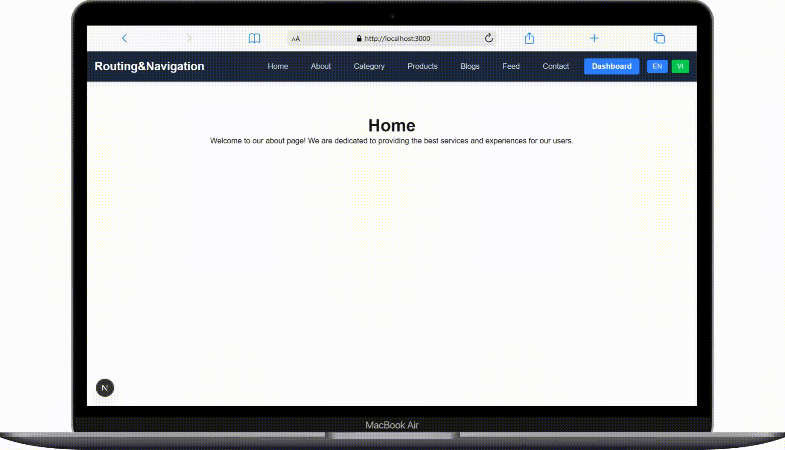

## Route không theo thư mục

Sau đây là phần điều hướng không theo cấu trúc thư mục:

```plaintext
/app
├── [...slug]
|   ├── layout.tsx
|   ├── page.tsx
```

```tsx
// app/[...slug]/layout.tsx

export default function RootLayout({
  children,
}: {
  children: React.ReactNode
}) {
  return (
    <html lang="en">
      <body>{children}</body>
    </html>
  )
}
```

Component muốn trả về

```tsx
// components/pages/demo1.tsx

'use client';

import React from 'react';

const Example: React.FC = () => {
console.log('First log');

    return (
        <div>
            <h1>Example Component 1</h1>
            <p>This is an example interface for demonstration purposes.</p>
        </div>
    );
};

export default Example;
```

Fake data lấy ra từ database

```ts
// app/api/components/routes.ts

export async function GET() {
    const data = [
        {
            url: "/dynamic-route/demo1",
            component: "demo1",
        },
        {
            url: "/dynamic-route/demo2",
            component: "demo2",
        }
    ];
    

    return new Response(JSON.stringify(data), {
        headers: { "Content-Type": "application/json" },
    });
}
```

Xử lý logic để trả về Component theo URL

```tsx
// app/[...slug]/page.tsx

import { notFound } from 'next/navigation';
import ComponentA from '@/components/pages/demo1';
import ComponentB from '@/components/pages/demo2';

const componentMap: { [key: string]: React.FC } = {
  demo1: ComponentA,
  demo2: ComponentB,
};

async function getRouteConfig(slug: string[]) {
  const path = '/' + slug.join('/');
  const res = await fetch('http://localhost:3000/api/components', {
    method: 'GET',
  });
  const routes = await res.json();
  
  return routes.find((r: { url: string, component: string }) => r.url === path);
}

export default async function Page({ params }: { params: Promise<{ slug: string[] }> }) {
  const { slug } = await params;
  const route = await getRouteConfig(slug);

  if (!route) return notFound();

  console.log('component', route.component);

  const Component = componentMap[route.component];

  if (!Component) return notFound();

  return <Component />;
}
```

Hình ảnh chỉ mang tính chất minh hoạ, mời mọi người vào [link demo](https://demo-routing-navigation.netlify.app/dynamic-route/demo1) để xem chi tiết ạ

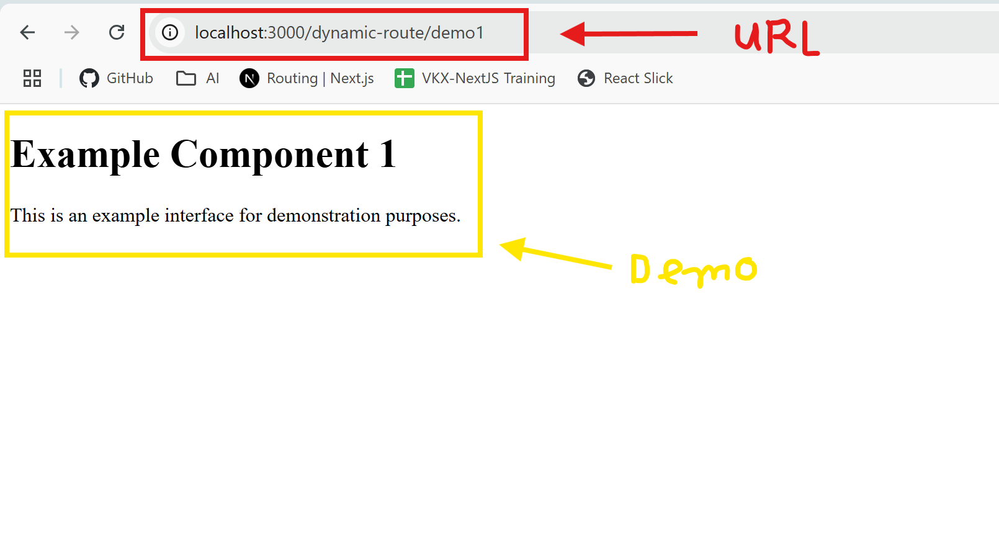
