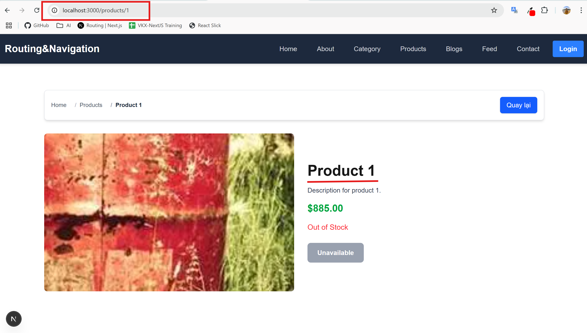

# Routing & Navigation

Tài liệu này cung cấp một số khái niệm và ví dụ cụ thể  về Routing & Navigation trong App Route của thằng Next.js. [Link sản phẩm](https://demo-routing-navigation.netlify.app/)

## Mục lục

- [Hướng dẫn chạy dự án](#hướng-dẫn-chạy-dự-án)
- [File-system - Route theo thư mục](#file-system---route-theo-thư-mục)
- [Client Side - Điều hướng](#client-side---điều-hướng)
- [Server Side - Điều hướng](#server-side---điều-hướng)
- [Giao diện](#giao-diện)
- [Next Server](#next-server)
- [Other](#other)
- [Route không theo thư mục](#route-không-theo-thư-mục)

---------------

## Hướng dẫn chạy dự án

## File-system - Route theo thư mục

### 1. Danh sách file

Dưới đây là danh sách file và mục đích sử dụng của từng file trong App Route:

| File          | Mục đích sử dụng                                                                 |
|:--------------|:---------------------------------------------------------------------------------|
| page.tsx      | Component chính của route                                                        |
| layout.tsx    | Dùng để bọc layout cho route và các route con                                    |
| template.tsx  | Giao diện bọc route con, nhưng khi điều hướng sẽ render lại                      |
| error.tsx     | Bắt lỗi khi render route                                                         |
| loading.tsx   | Hiển thị khi đang tải                                                            |
| not-found.tsx | Hiển thị khi không tìm thấy nội dung (page 404)                                  |
| default.tsx   | Định nghĩa nội dung mặc định cho một route khi không có route con nào được chọn  |
| route.ts      | Tạo ra các API route                                                             |

Ví dụ minh hoạ về cấu trúc file:

```plaintext
/app
├── dashboard
│   ├── page.tsx
│   ├── layout.tsx
│   ├── template.tsx
│   ├── error.tsx
│   ├── loading.tsx
│   ├── not-found.tsx
├── api
│   └── route.ts
├── layout.tsx
├── page.tsx
```

### 2. Route group

Trong App Route chúng ta có thể nhóm các chức năng giống nhau vào 1 nhóm chung bằng 1 thư mục bằng cú pháp `(tên thư mục)`. Ví dụ minh hoạ:

```plaintext
/app
├── (auth)
│   ├── login
│   |    ├── page.tsx
│   ├── register
│   |    ├── page.tsx
│   ├── profile
│   |    ├── page.tsx
│   ├── layout.tsx
├── layout.tsx
├── page.tsx
```

### 3. Đường dẫn động

Đường dẫn động(Dynamic Routes) là cách chúng ta sử dụng các url có nhận tham số, để thay đổi thông tin dựa vào tham số nhận được.

Ví dụ minh hoạ:

```plaintext
/app
├── (home)
│   ├── products
│   ├── ├── [id] 
│   ├── |    ├── page.tsx
│   ├── ├── page.tsx
├── ├── layout.tsx
├── ├── page.tsx
```

```tsx
//app/products/[id]/page.tsx
export default async function ProductDetail({ params }: { params: Promise<{ id: string }> }) {
  const { id } = await params;

  return (
    <div>
      <h1>
        Product Detail: {id}
      </h1>
    </div>
  );
}
```

Hình ảnh demo:



### 4. Chặn route

Khái niệm về `Intercepting Routes` dùng để chặn một yêu cầu đi đến route cụ thể và thay đổi hành vi của nó, thường sử dụng để hiển thị 1 nội dung khác hoặc xử lý logic mà không thay đổ URL. Một số ứng dụng thực tế như: modal, drawer, tab, ...

## Client Side - Điều hướng

Navigation - Điều hướng là quá trình chuyển sang 1 trang khác mà không cần phải tải lại toàn bộ trang. Cách này chỉ được sử dụng khi người dùng tác động

### 1. Linking

Chúng ta sẽ sử dụng `Link Component` để điều hướng trang web, và sau khi render sang html `Link Component` sẽ được hiển thị dưới dạng thẻ a . Ví dụ cụ thể:

```tsx
// components/layout/header.tsx
import NavLink from "../ui/navlink";

export default function Header() {
    return (
      <ul className="flex items-center space-x-4">
          <li>
              <NavLink href="/">
                  Home
              </NavLink>
          </li>
          <li>
              <NavLink href="/about">
                  About
              </NavLink>
          </li>
      </ul>
    )
}
```

Hình ảnh demo:


### 2. Navigation

Sử dụng hook `useRouter` của `"next/navigation"` để trong xử lý logic hoặc handler sự kiện trong môi trường client side. Dùng để điều hướng đến một URL mới ở trang hiện tại, và sẽ có 2 cách chính là `push`, `replace`

>Lưu ý: `useRouter` chỉ được sử dụng trong môi trường client side, và khi import tránh nhầm thằng `"next/router"` vì cái mình cần dùng là `"next/navigation"`

`router.push('/new-url')` dùng khi muốn điều hướng sang trang mới và đồng thời thêm mới đường dẫn thay đổi vào lịch sử trình duyệt trình duyệt

```tsx
// app/(home)/about/page.tsx
'use client'

import { useRouter } from "next/navigation";

export default function About() {
  const router = useRouter();
  
  return (
    <button 
      onClick={() => router.push('/')} 
    >
      Go Back to Home (Hook)
    </button>
  );
}
```

Hình ảnh demo:


`router.replace('/updated-url')` cái cũng sẽ điều hướng sang trang mới, nhưng khác `push` ở chỗ ở `push` sẽ tạo mới lịch sử nhưng cái này sẽ cập nhật lại url trang hiện tại trong lịch sử trình duyệt

```tsx
// app/(home)/contact/page.tsx
'use client'

import { useRouter } from "next/navigation";

export default function Contact() {
  const router = useRouter();
  
  return (
    <button 
      onClick={() => router.replace('/')} 
    >
      Go Back to Home (Hook)
    </button>
  );
}
```

Hình ảnh demo:


Thằng hook `useRouter` của `"next/navigation"` vẫn còn một số thuộc tính như: pathname, query, asPath, isFallback để lấy thông tin URL hay các phương thức khác như: back(), reload(), prefetch().  Vì nó không liên quan lắm đến phần này nên mình sẽ không đưa vào để tránh loạn, anh em chịu khó tìm hiểu thêm sau nhé

### 3. Window

Nếu như bạn đã học về javascript thì cũng sẽ biết thằng window cũng có một số phương thức để điều hướng trang. Cũng vậy thằng next.js vẫn sẽ cho phép sử dụng các phương thức như vậy, có 2 cái cần nói đến ở đây đó là `window.history.pushState` và `window.history.replaceState`.

>Lưu ý: `window.history.pushState` và `window.history.replaceState` trong nextjs cũng có phương thức tương tự là sử dụng hook `useRoute` với `router.push('/new-url')` và `router.replace('/updated-url')`. Cho nên phần window này chỉ nêu ra để biết là có thể sử dụng mà thôi chứ không hay dùng

`pushState(stateObj, title, url)` Nó sẽ thêm mới 1 đường dẫn vào lịch sử của trình duyệt, và điều hướng trang đến url mới mà không phải reload lại trang hiện tại.

```tsx
// app/(home)/about/page.tsx
'use client'

export default function About() {
  const pushWindow = (url: string) => {
    window.history.pushState({}, '', url);
  }

  return (
    <button
        onClick={() => pushWindow('/')}
      >
        Go Back to Home (Window)
      </button>
  );
}
```

Hình ảnh demo:


`replaceState(stateObj, title, url)` Cái này nó sẽ thay thế URL trang hiện tại và thay thế cả trong lịch sử trình duyệt

```tsx
// app/(home)/contact/page.tsx
'use client'

export default function Contact() {
  const replaceWindow = (url: string) => {
    if (typeof window !== 'undefined') {
      window.history.replaceState({}, '', url);
    }
  }
  
  return (
    <button
        onClick={() => replaceWindow('/')}
        className="bg-blue-600 hover:bg-blue-700 text-white px-6 py-3 rounded-lg mt-8 shadow-lg transition-all duration-300 transform hover:scale-105"
      >
      Go Back to Home (Window)
    </button>
  );
}
```

Hình ảnh demo:


### 3. So sánh giữa các phương thức thay đổi URL

| Phương thức               | Thay đổi URL | Điều hướng | Lịch sử trình duyệt | Tương thích Next.js Router | Ghi chú |
|---------------------------|--------------|--------------|------------------------|---------------------------|---------|
| `window.history.replaceState` | ✅ Có        | ❌ Không     | ❌ Thay thế đường dẫn hiện tại | ❌ Không đồng bộ | Chỉ thay đổi URL, không kích hoạt điều hướng hay cập nhật Next.js Router |
| `router.replace()` (Next.js) | ✅ Có       | ✅ Có     | ❌ Thay thế đường dẫn hiện tại | ✅ Có (đồng bộ) | Nên dùng thay thế để đồng bộ với Next.js |
| `window.history.pushState` | ✅ Có        | ❌ Không     | ✅ Thêm đường dẫn mới       | ❌ Không đồng bộ | Thêm URL mới vào lịch sử trình duyệt |
| `router.push()` (Next.js)  | ✅ Có        | ✅ Có     | ✅ Thêm đường dẫn mới       | ✅ Có (đồng bộ) | Đồng bộ với Next.js Router, hỗ trợ tải trước trang |

## Server Side - Điều hướng

Redirect là việc chuyển người dùng đến một URL khác, trước hoặc trong lúc trang đang load. Có thể sử dụng ở 2 môi trường server và client

### 1. redirect function

`redirect` là 1 function có thể sử dụng ở cả môi trường server side và client side

### 2. Client

permanentRedirect

### 3. Next config

redirects in next.config.js

### 4. Middleware

NextResponse.redirect in Middleware

## Giao diện

### 1. Layout & Page

### 2. Template

### 3. Parallel

### 4. Error

### 5. Loading

## Next Server

### 1. Route Handlers

### 2. Middleware

### 3. Route caching

## Other

### 1. Localization - Ngôn ngữ

## Route không theo thư mục
